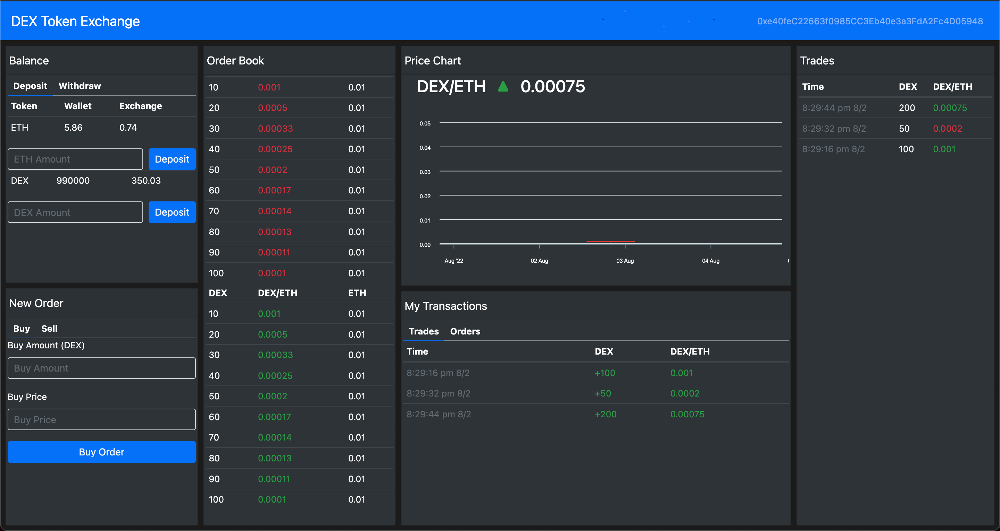

# DEX Token Exchange

This project is a decentralized exchange that allows to trade between two assets: ETH and DEX (a custom ERC-20 Token created for this exchange).

It could support other ERC-20 Tokens as well, just by adding the contracts.

The main features of this DAPP are deposit ETH or DEX Token, Open/Put/Cancel buy/sell orders and to see a price graph and history of all.

## Live version
Go [here](https://danielruizc.com/projects/dex-token-exchange) to see it in action.


## Requirements
> If you want to install and run this project in your local environment, these are the requirements:
> - NodeJS version v14.16.0
> - Python 2.7 (install pyenv in order to manage multiple Python versions in your system)
> - Truffle framework
> - Ganache local blockchain

## Installation & Configuration

> ### Install project dependencies
> To install and set up the project, run:
> ```
> npm install -g node-gyp@3.6.2
> npm install
> ```
>
> ### Update project private Configuration
> Duplicate or replace `config.env` file to `.env` and update the values/settings to your own.
> *you can skip replacing values if don't want to push project to a public blockchain, however, the `.env` file must exist for tests to pass*
>
> ### Test Smart Contracts
> To check contracts are OK, you can run:
> ```
> truffle test
> ```
>
> ### Compile and Migrate Contracts
> To compile and migrate contracts to load them in the app, run:
> ```
> truffle migrate
> ```
>
> ### Seed the Exchange
> In order to have some data initially in the Exchange, you can run the seeder script with:
> ```
> truffle exec scripts/seed-exchange.js
> ```
> 
> ### (Optional) Seed Metamask
> You can also send ETH and DEX Tokens to two additional accounts you preffer with:
> ```
> truffle exec scripts/seed-metamask.js
> ```
> *don't forget to change to your addresses in `seed-metamask.js`*
>
> ### Import account into Metamask
> Import at least the first ganache account into Metamask using its private key.
> *The first two accounts (or first four if you ran `seed-metamask.js`) will have ETH and DEX Tokens as well*

## Usage
> Finally, run the app with:
> ````
> npm run start
> ````
> and connect with one of the first two (or four) accounts.

## Contact
> Do not hesitate to contact me for any questions or suggestions.
> 
> Daniel Ruiz <druizcallado@gmail.com>
